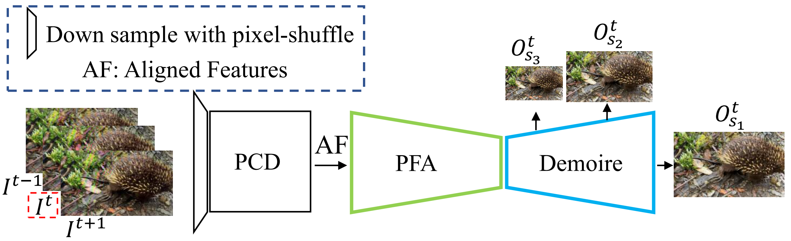
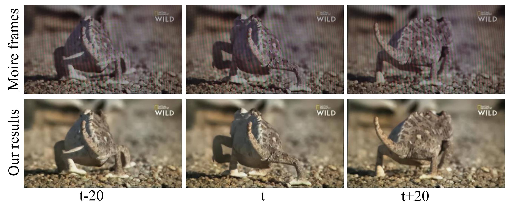

# Video Demoireing with Relation-Based Temporal Consistency

**Video Demoireing with Relation-Based Temporal Consistency** (CVPR 2022)  
Peng Dai, Xin Yu, Lan Ma, Baoheng Zhang, Jia Li, Wenbo Li, Jiajun Shen, [Xiaojuan Qi](https://scholar.google.com/citations?user=bGn0uacAAAAJ&hl=en).
<br>[Paper](https://arxiv.org/pdf/2204.02957.pdf), [Project_page](https://daipengwa.github.io/VDmoire_ProjectPage/), [Video](https://www.youtube.com/watch?v=73mCqfWobBo)


## Introduction

<br>
Our video demoireing network mainly consists of three parts: First, the PCD takes consecutive frames as inputs to implicitly align frames in the feature space. Second, the feature aggregation module merges aligned frame features at different scales by predicting blending weights. Third, the merged features are sent to the demoire model with dense connections to realize moire artifacts removal.

## Dataset
We constrcut the first video demoireing dataset, containing 290 videos (720p, 60 frames for each video), and the equipments we adpoted are 'TCL20 pro mobile phone + Huipu v270 monitor' and 'iPhoneXR + MackBook Pro'. 
<br> 
<br>
In [data_v1](https://www.dropbox.com/sh/5pkntn20785gqqj/AADmYCroOu5YDhzGam6Nhoz9a?dl=0), image pairs are aligned using the homography. In [data_v2](https://www.dropbox.com/sh/7trmzm2slm2qlg8/AADt3e8MH_52EyLKFtZwXirJa?dl=0), aligned image pairs are refined using the estimated optical flow. Besides, we also provide the [original](https://www.dropbox.com/sh/1mdmsss20f0ean9/AAAu3kS_jiDzOP_UaKT4grgPa?dl=0) moire videos. The [Baidu_disk_link](https://pan.baidu.com/s/18evBGvTHwN2lL2Oo7ao8-Q), and the password: b28v 
<br>
<br>
Please download and unzip the dataset you need, then change the data paths in 'config/video_demoire_temporal_mbr_scratch_v2.yaml' line 7 and 8. Note that the results in our paper are based on the data_v1.  
<br>
<br>
To train a model better suited for your use or device, you can follow the 'dataset_prepare/data_prepare.py' step by step to prepare your own training data.


## Environments

Create the conda virtual environment (python 3.7) and activate it.
<br>
```conda create -n vdm python=3.7```
<br>
```conda activate vdm ```
<br>
<br>
Intsall pytorch 1.6.0 and other libaries in the 'requirements.txt'.
<br>
```conda install pytorch==1.6.0 torchvision==0.7.0 cudatoolkit=10.2 -c pytorch```
<br>
```pip install -r requirements.txt```
<br>
<br>
Install the DCNv2.
<br>
```cd model/DCNv2```
<br>
```python3 setup.py build develop```
<br>
<br>
Our implementation has been tested on one NVIDIA 2080Ti GPU with cuda 10.2.


## Train
To train the model, just run:
<br>
```python train.py --config config/video_demoire_temporal_mbr_scratch_v2.yaml```
<br>
<br>
Note: if too large offsets appear while training the PCD model, please restart training. Alternatively, you can use this [model](https://www.dropbox.com/s/24aq2eztafuiyjp/checkpoint_000002.tar?dl=0) (train two epoches) to initialize the network.      

## Test
To test the model, just run:
<br>
```python test.py --config config/video_demoire_temporal_mbr_scratch_v2.yaml```
<br>
<br>
We also provide pre-trained models for both [TCL](https://www.dropbox.com/sh/9yqd5ui9h7cjwy3/AADSn8AFEP4ewzk3QFdwpz8-a?dl=0) and [iPhone](https://www.dropbox.com/sh/jalr5860ukesgvl/AAC2ozt00TgzWzSgFTRG-z8ma?dl=0). The 'checkpoint_000049.tar' means no realtion-based loss, and 'checkpoint_000059.tar' means with realtion-based loss. Please download these models into the corresponding folder (line 29) and change the test epoch (line 54) as descirbed in 'config/video_demoire_temporal_mbr_scratch_v2.yaml'.  


## Results



## Contact
If you have any questions, you can email me (daipeng@eee.hku.hk).

## Citation
If you are interested in our code or method, please consider citing the following:
```
@inproceedings{dai2022video,
  title={Video Demoireing with Relation-Based Temporal Consistency},
  author={Dai, Peng and Yu, Xin and Ma, Lan and Zhang, Baoheng and Li, Jia and Li, Wenbo and Shen, Jiajun and Qi, Xiaojuan},
  booktitle={Proceedings of the IEEE/CVF Conference on Computer Vision and Pattern Recognition},
  year={2022}
}
```


